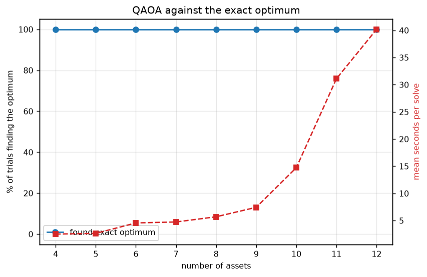
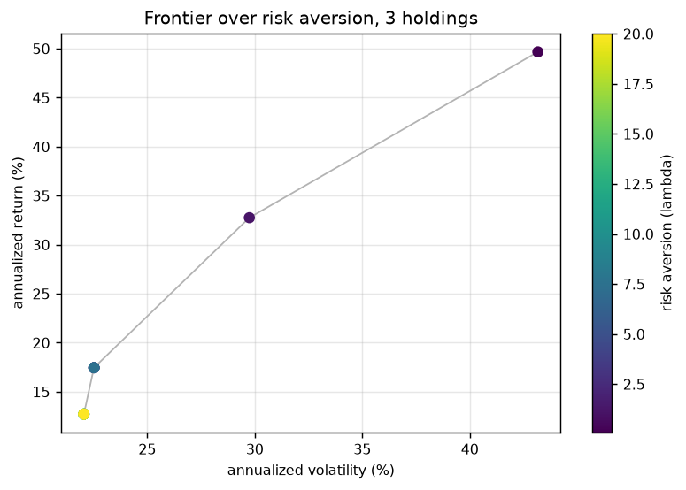
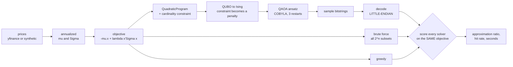
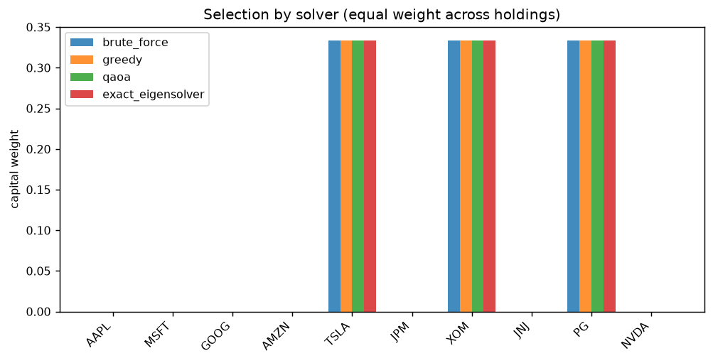

# Quantum Portfolio Selection: QAOA against an exact solver

[](https://github.com/vincal848/quantum-portfolio/actions/workflows/tests.yml)

This started as an extension of a project in *PHYS 4315: Introduction to Quantum
Computing*, cross-listed as *ECE 5332*. Most of the background came from Thomas
Wong's ***Introduction to Classical and Quantum Computing***, with sections of
Nielsen and Chuang. The idea was to treat asset selection as a MaxCut-like problem
on a graph — nodes are assets, edges carry covariance — and solve it with QAOA. My
notes on the classical/quantum comparison, QAOA and adiabatic quantum computing are
in [docs/BACKGROUND.md](docs/BACKGROUND.md).

I have rebuilt it, and the honest result is not the one the original implied.
**QAOA finds the exact optimum on every problem tested — 45 out of 45 — and takes
about 20,000 times longer than simply enumerating every subset.** A greedy classical
pass matches it in microseconds. That is the expected outcome at simulable sizes, and
saying so is more useful than a result that quietly avoids the comparison.

I also found that the original was reporting **the wrong assets**, because Qiskit's
bit ordering is the reverse of how the code read it.



## At a glance

| | |
|---|---|
| **Problem** | Cardinality-constrained mean-variance selection: minimize `−μ·x + λ x'Σx` s.t. `Σx = k`, `x ∈ {0,1}ⁿ` |
| **Solvers** | Brute force (exact reference), greedy, QAOA on a statevector simulator, exact Ising diagonalization |
| **Data** | 10 US equities, 2020-01-01 to 2023-01-01, annualized moments; or synthetic |
| **Result** | QAOA found the optimum in 45/45 trials, n = 4 to 12 |
| **Cost** | QAOA 11.7s vs brute force 0.0006s on the 10-asset problem — about 20,000× |
| **Stack** | Python, Qiskit 2.x, SciPy, pandas |

## Results

**10 assets, pick 3, λ = 0.5, real prices, annualized:**

| solver | selected | objective | found optimum? | seconds |
|---|---|---|---|---|
| brute force | TSLA, XOM, PG | −0.678774 | — (reference) | 0.0006 |
| greedy | TSLA, XOM, PG | −0.678774 | yes | 0.0001 |
| QAOA | TSLA, XOM, PG | −0.678774 | yes | 11.69 |
| exact Ising diagonalization | TSLA, XOM, PG | −0.678774 | yes | 0.011 |

All four agree, giving 38.57% annualized return at 32.61% volatility, Sharpe 1.091.

**Does QAOA keep finding the optimum as the problem grows?** Five random problems at
each size, cardinality 3:

| assets | qubits | found optimum | mean approximation ratio | mean seconds |
|---|---|---|---|---|
| 4 | 4 | 5/5 | 1.0000 | 2.5 |
| 6 | 6 | 5/5 | 1.0000 | 4.6 |
| 8 | 8 | 5/5 | 1.0000 | 5.7 |
| 10 | 10 | 5/5 | 1.0000 | 14.7 |
| 11 | 11 | 5/5 | 1.0000 | 31.1 |
| 12 | 12 | 5/5 | 1.0000 | 40.2 |

**45 out of 45.** QAOA is correct here. It is also the slowest thing in the table by
four orders of magnitude, and the gap widens with every qubit, because simulating the
circuit costs `2ⁿ` classically. The exact answer is free at these sizes.

That is not a failure of QAOA — it is the point. A quantum heuristic can only be
interesting where classical exhaustive search is not, which is beyond what a
simulator can reach. Any portfolio result at n = 12 that claims a quantum advantage
is claiming something these numbers directly contradict.

**Frontier over risk aversion.** Sweeping λ from 0.1 to 20 moves the selection from
TSLA/XOM/NVDA at 49.7% return and 43.2% volatility to GOOG/JNJ/PG at 12.7% and
22.1% — growth names giving way to defensives as risk aversion rises. That behaviour
is what says the objective and the moment estimates are wired up correctly.



## How it works



QAOA is built directly on Qiskit 2 primitives — `QAOAAnsatz`,
`StatevectorEstimator`, `StatevectorSampler` — with SciPy's COBYLA as the classical
optimizer, restarted from three random points because the energy landscape is
non-convex. It does not use `qiskit-algorithms`, which no longer works with Qiskit 2.

## Decisions

- **Brute force is the reference, not another heuristic.** At n ≤ 20 the exact
  optimum is cheap, so there is no reason to score an approximate method against
  anything softer.
- **Greedy is included deliberately.** "QAOA beat random" is not a finding. The
  question is whether it beats what someone would actually reach for.
- **Equality rather than inequality on the cardinality constraint.** `Σx <= k` needs
  slack variables and the converter spends real qubits on them — a 10-asset problem
  becomes 12 qubits. `Σx == k` stays at 10. On a simulator that is the difference
  between running and not.
- **Feasibility is checked, never assumed.** The constraint is only a penalty in the
  Hamiltonian, so nothing stops an infeasible bitstring being the most-sampled one.
  The solver takes the best *feasible* sample and separately records whether the top
  sample was feasible.
- **The objective is defined in one place.** Every solver is scored with
  `portfolio.objective`, so none can look good by optimizing something subtly
  different.
- **Everything is seeded.** Two runs give the same selection.

## Quick start

```bash
pip install -r requirements.txt
```

```bash
python run.py --synthetic --no-figures     # no network needed
```

```
covariance positive semi-definite: True

10 assets, pick 3, lambda=0.5, risk-free 3%
solver            selected                       objective    approx  optimal?  seconds
brute_force       A0, A6, A7                     -0.478669    1.0000       yes    0.001
greedy            A0, A6, A7                     -0.478669    1.0000       yes    0.000
qaoa              A0, A6, A7                     -0.478669    1.0000       yes    5.567
exact_eigensolver A0, A6, A7                     -0.478669    1.0000       yes    0.013
```

Other options:

```bash
python run.py                   # real prices for 10 tickers
python run.py --all             # frontier and scaling study, writes figures
python run.py --scaling         # does QAOA still find the optimum as n grows?
python run.py --no-qaoa         # classical solvers only, instant

pytest tests -q                 # 32 tests
pytest tests -q -m "not slow"   # 25 of them, no qiskit needed
```

## Repository guide

| Path | Contents |
|---|---|
| `portfolio.py` | The objective, the QuadraticProgram, the Ising conversion, and the little-endian decode |
| `solvers.py` | Brute force, greedy, QAOA, exact Ising diagonalization — one shape each |
| `metrics.py` | Return, volatility, Sharpe and annualization, on a consistent basis |
| `data.py` | Price loading with caching, moment estimation, PSD repair |
| `run.py` | The comparison, the frontier, the scaling study, `results/` and figures |
| `tests/` | 32 tests |
| `docs/BACKGROUND.md` | My original write-up: classical vs quantum, QAOA, adiabatic computing |
| `legacy/` | The three original scripts, annotated. None run on current dependencies |



## Future interests

- **A problem size where the comparison gets interesting.** Everything here is
  solvable exactly, so nothing QAOA does can be surprising. Either move to hardware,
  or to a structured problem where the classical baseline genuinely struggles.
- **Warm-start QAOA and CVaR objectives**, both reported to help on constrained
  portfolio problems, and which would give the parameter optimization something
  better than random restarts.
- **Constraint handling without a penalty.** An XY mixer preserves the number of
  holdings by construction, so the search never leaves the feasible set and no
  post-hoc filtering is needed.
- **Compare against a real integer-programming solver** rather than brute force, so
  the classical baseline is one a practitioner would defend.
- **Quantum coins and quantum walks**, which is where I wanted to take the quantum
  side of this originally.

## Notes

- `exact_eigensolver` needs `qiskit-algorithms`, which is only maintained for
  Qiskit 1.x; its NumPy eigensolver path still works here, but its QAOA does not.
- Timings are single-core on one machine and vary between runs. The selections and
  objectives are seeded and stable.
- All numbers in this README come from `python run.py --all` and are recorded in
  `results/results.json`.
